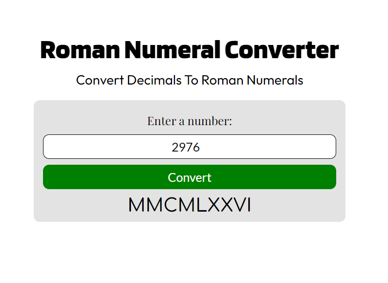

# Palindrome Checker
 A simple program page that converts a given number to Roman Numerals representation, made for FreeCodeCamp certification Project using HTML, CSS and JavaScript.

 You only need a browser to view and use this program, open the index.html file.

## Page Preview
